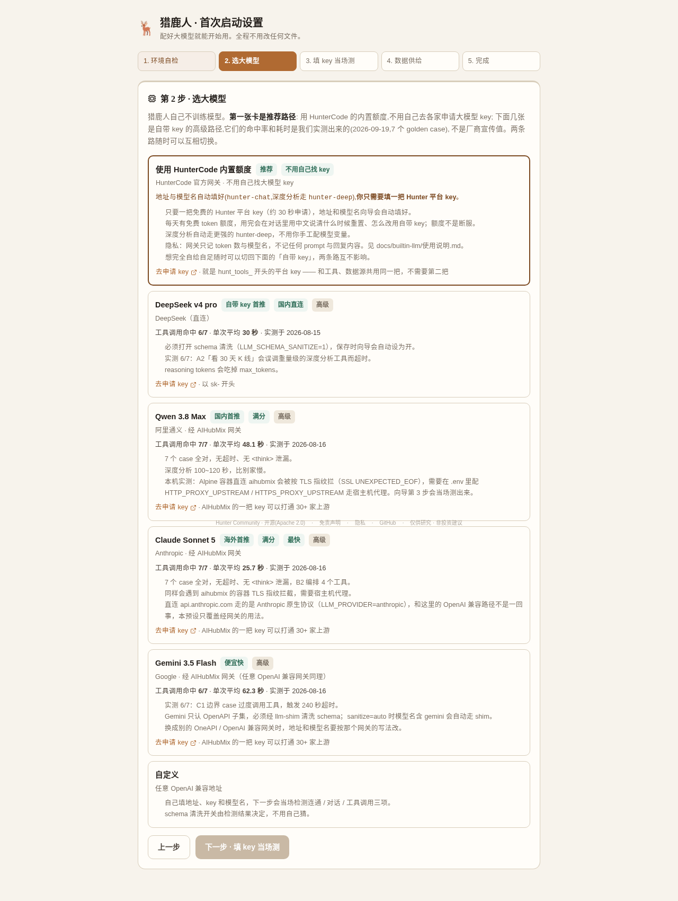
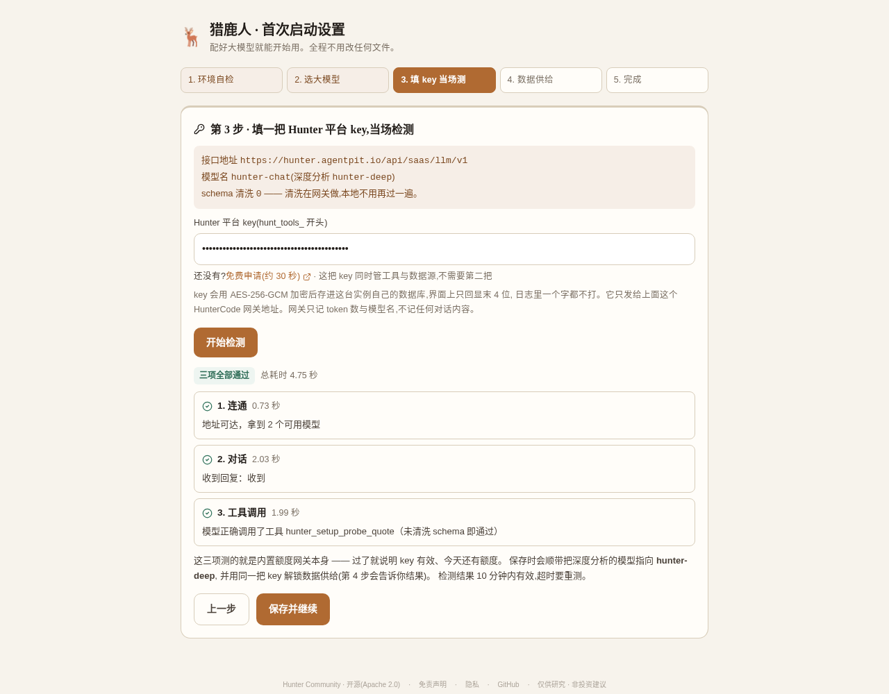
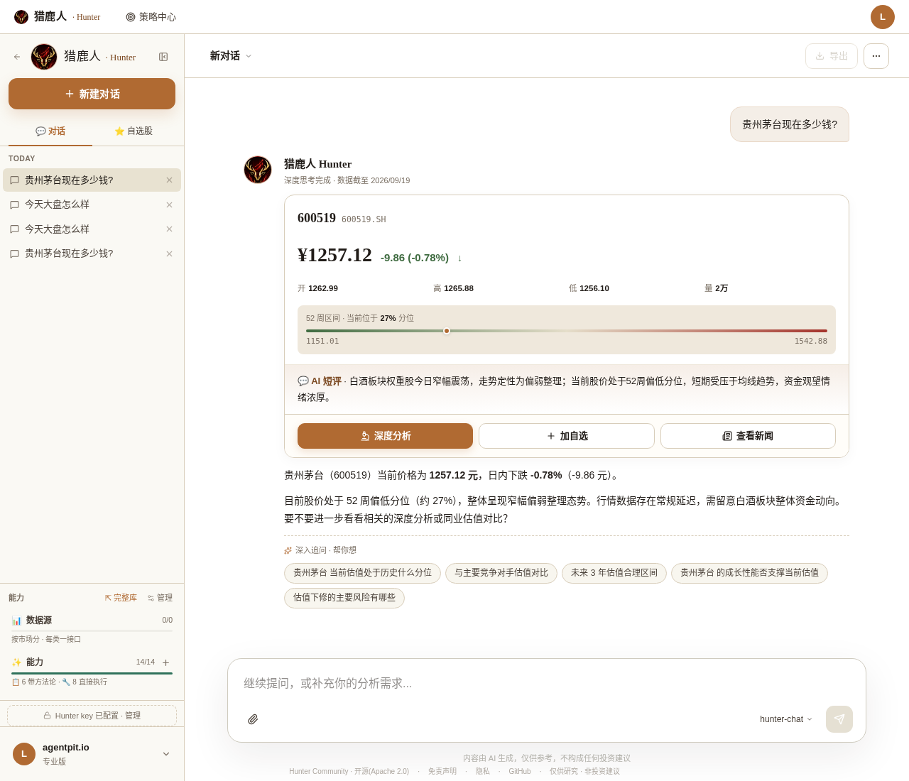
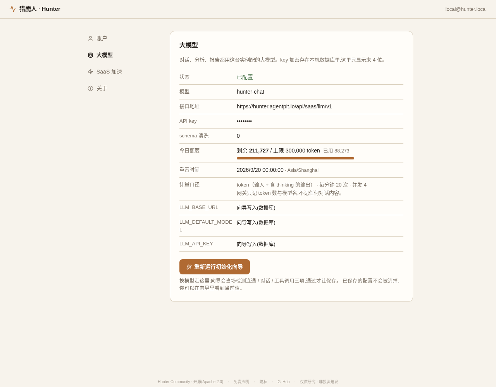
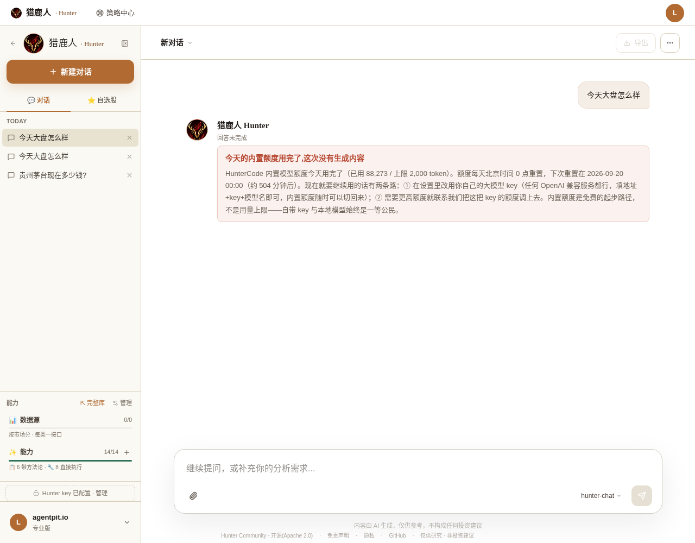

# 内置模型额度 · 使用说明

> 适用版本:v1.2.0 起
> 一句话:**不用自己去各家申请大模型 key,一把免费的 Hunter 平台 key 就能开始对话。**
> 使用前请读一遍 [**服务条款与可接受使用政策**](./服务条款.md)（[English](./terms-of-service.md)）——
> 仅限自部署用户的研究用途,禁止转售与当通用 API 用;额度与服务可能调整或下线。

---

## 一、这是什么

猎鹿人自己不训练模型,对话和分析都要有一个大模型在后面。以前你必须先去
DeepSeek / 通义 / AIHubMix 之类的地方注册、充值、拿一把 key,才能发第一条消息 ——
这一步挡掉了不少人。

**内置额度**是我们提供的一条起步路径:你申请一把免费的 `hunt_tools_` 平台 key
(那把 key 本来就要申请,它管工具、SKILL 和数据源),填进向导,就能直接用。
每天有一份免费的 token 额度。

它是**可选的起步路径,不是默认唯一路径**。自带 key 与本地模型始终是一等公民:

| | 内置额度(推荐) | 自带 key(高级) |
|---|---|---|
| 要几把 key | **1 把**(`hunt_tools_`,和工具/数据源共用) | 2 把(平台 key + 大模型 key) |
| 地址 / 模型名 | 向导自动填 | 自己填,向导当场检测三项 |
| 模型 | `hunter-chat` / `hunter-deep` 两个 | 任何 OpenAI 兼容服务 |
| 用量 | 每天有免费额度,用完次日 0 点重置 | 你自己的账单,不限 |
| 推理在哪跑 | 我们的网关 → 上游模型 | 你选的那家 |
| 对话内容 | 网关**不记录**(见第五节) | 取决于你选的那家 |

两条路**随时可以互相切换**:设置 → 大模型 → 「重新运行初始化向导」,
重选一张卡片即可,已有的会话、SKILL、数据一个都不会丢。

---

## 二、怎么用(3 步)

### 1. 申请一把平台 key

<https://hunter.agentpit.io/dev/api-keys> —— 免费,约 30 秒,拿到的是
`hunt_tools_` 开头的一串。

### 2. 起服务,走向导

```bash
git clone https://github.com/agentpit-io/hunter-community
cd hunter-community
docker compose up -d
open http://localhost:3100
```

**不用建 `.env`,不用改任何文件。**

### 3. 向导第 2 步选第一张卡

「**使用 HunterCode 内置额度(推荐)· 不用自己找大模型 key**」。
选中后地址与模型名自动填好,第 3 步只要把那把 `hunt_tools_` key 粘进去,
点「开始检测」——

- 连通:问网关有哪些模型(只会看到 `hunter-chat` / `hunter-deep` 两个)
- 对话:发一条真实消息
- 工具调用:发一个故意写脏的工具 schema(清洗在网关做,所以脏的也能过)

三项全过才让保存。保存之后向导会顺带做两件事,**不用你再操心**:

1. 把深度分析相关的模型变量一并指向 `hunter-deep`(不写的话「对话能用、深度分析是坏的」);
2. 用**同一把 key** 解锁数据供给 —— 所以第 4 步会直接告诉你「已解锁」,不用再填一遍。

最后一步热生效,**不重启任何容器**,直接进对话。

<p align="center">
  
</p>
<p align="center">
  
</p>
<p align="center">
  
</p>

全部 11 张截图见 [`docs/screenshots/builtin-llm/`](../screenshots/builtin-llm/)。

---

## 三、两个模型

内置额度只提供两个模型名,网关内部映射到真实模型。换上游时你这边零改动。

| 模型名 | 用途 | 什么时候会用到 |
|---|---|---|
| `hunter-chat` | 默认对话、工具调用 | 你在对话框里问的每一句 |
| `hunter-deep` | 深度分析、研报类长任务 | UZI 深度分析、深度研究子智能体 |

**填别的模型名会被拒绝**,错误信息里会告诉你可用的是哪两个。
想用别的模型请改走自带 key 那条路 —— 那条路不限模型。

---

## 四、额度

- **单位是 token**(输入 + 含 thinking 的输出),不是「几次对话」。
  一次深度分析的消耗是一次问价的几十倍,按次数算对只问价的人不公平。
- **每天北京时间 0 点重置。**
- **在哪看**:设置 → 大模型 → 「今日额度」,显示剩余 / 上限 / 已用 / 重置时间。
  数字直接来自网关,前端不换算、不补默认值;取不到就显示「—」并说明原因。
- **用完了会怎样**:对话里会出现一张中文说明卡,写清「今天用完了、几点重置、
  现在能怎么办」。**不是断服、不是空白、不是一句英文报错。**

<p align="center">
  
</p>
<p align="center">
  
</p>

用完之后有两条路:

1. 等次日 0 点自动恢复;
2. 现在就要继续用 → 设置 → 大模型 → 「重新运行初始化向导」,
   选一张自带 key 的卡片填上你自己的 key。**内置额度随时可以切回来。**

需要更高额度可以联系我们把这把 key 的额度调上去。

### 还有两种「不是你的额度用完了」的拒绝

对外开放之后我们加了两道**全平台**的闸门。碰上时对话里同样是一张中文说明卡,
不是转圈也不是英文报错 —— **两种都跟你个人的额度无关**:

| 你看到的 | 什么意思 | 怎么办 |
|---|---|---|
| 「内置额度今天整体用满了」 | 全平台当日总量到了熔断线(成本刹车) | 等次日 0 点,或现在就切自带 key |
| 「内置额度当前已暂停服务」 | 我们把内置额度整体关掉了(维护 / 上游故障 / 下线) | 切自带 key;进展看[讨论区公告](https://github.com/agentpit-io/hunter-community/discussions) |

两种情况下**你的工具、数据供给、SKILL、已有会话与数据都不受影响** ——
停的只是「我们替你调模型」这一步。切自带 key 是设置里的几步操作,
见上面那两条路的第 2 条。

---

## 五、隐私声明

> **网关只记录 token 数与模型名,不记录任何 prompt 与回复内容。**

具体到落库的字段,只有这些:

```
key_id · 时间 · 模型别名 · 上游真实模型 · 输入 token 数 · 输出 token 数
· 是否估算 · 耗时毫秒 · HTTP 状态码
```

没有 prompt、没有回复、没有工具参数、没有股票代码,一个字都没有。
这条是写进网关代码注释里的硬约束,也是我们对外的承诺。

**其余数据仍然在你自己的机器上**:会话正文在你的 opencode 卷里,自选股、持仓、
研究记录在你自己的 Postgres 里 —— 内置额度**不改变**这一部分。
改变的只有一件事:推理这一步发生在我们的网关后面,而不是你直接连上游。

如果你连「问题文本经过我们的服务器」都不接受,那就走自带 key 或本地模型那条路。
这是我们把它设计成**可选起步路径**而不是默认唯一路径的原因。

其他约束:

- 按 key 计量,可以按 key 停用 —— 滥用会被停,正常使用不受影响。
- 网关不是通用 LLM API:只开放两个模型别名,有每分钟请求数与并发上限,
  禁止转售、禁止当通用 API 用。
- 网关代码在 `hermes` 侧,行为在 `docs/builtin-llm/P2-成果与测试报告.md` 与
  hermes 的 `doc/llm-gateway/P1-成果与测试报告.md` 里有完整实测记录。

---

## 六、想在 `.env` 里写死(一键部署模板)

不走向导也行,三项这么写:

```bash
LLM_BASE_URL=https://hunter.agentpit.io/api/saas/llm/v1
LLM_API_KEY=hunt_tools_xxxxxxxxxxxxxxxx      # 就是平台 key,不用第二把
LLM_DEFAULT_MODEL=hunter-chat
LLM_SCHEMA_SANITIZE=0                        # 清洗在网关做,本地不用再过一遍
```

然后 `docker compose up -d`(**不是 restart** —— restart 不重读 `.env`)。

这么写时这台实例是**锁定**状态,向导只读展示、改不了它;设置页的额度显示照常生效
(它认的是地址,不是向导写的标记)。

⚠️ **写死时深度分析那批模型变量要自己填**,走向导的话它们是向导自动写的:

```bash
ASSISTANT_MODEL_ROUTE=hunter-chat
ASSISTANT_MODEL_CHAT=hunter-chat
ASSISTANT_MODEL_COMPRESS=hunter-chat
AGENT_MODEL_ROUTER=hunter-chat
AGENT_MODEL_ROUTE_LITE=hunter-chat
AGENT_MODEL_GENERAL_FINANCE=hunter-chat
AGENT_SUB_WL_MODEL=hunter-chat
AGENT_SUB_PORT_MODEL=hunter-chat
AGENT_SUB_EVENT_MODEL=hunter-chat
SIGNAL_ANALYSIS_MODEL=hunter-chat
AGENT_SUB_RESEARCH_MODEL=hunter-deep
AGENT_SUB_UZI_MODEL=hunter-deep
```

不填的表现是:**对话正常,深度分析走到 LLM 汇总那一步整个失败,只能用模板兜底。**

---

## 七、排错

| 现象 | 多半是 | 怎么办 |
|---|---|---|
| 第 3 步「连通」报 key 无效 | key 打错了,或不是 `hunt_tools_` 开头 | 重新复制一遍;到 <https://hunter.agentpit.io/dev/api-keys> 确认 key 还在 |
| 第 3 步三项都超时 | 容器连不上外网(宿主机开了 Clash / Verge 之类的 TUN 代理) | 在 `.env` 里设 `HTTP_PROXY_UPSTREAM` / `HTTPS_PROXY_UPSTREAM`,见 README |
| 对话里出现「今天的内置额度用完了」 | 就是用完了 | 等次日 0 点,或切自带 key(第四节) |
| 对话里出现「请求太频繁」 | 每分钟请求数超限 | 等一分钟;脚本批量跑请自己加间隔 |
| 深度分析失败、只出模板兜底 | 那批 agent 模型变量没写上 | 重跑一遍向导(它会重写);`.env` 写死的按第六节自己填 |
| 设置页额度显示「—」 | 取不到额度(网络 / key) | 卡片上会写明原因;对话本身不受影响 |

---

## 八、相关文档

- [**服务条款与可接受使用政策**](./服务条款.md) · [English](./terms-of-service.md)
  —— 开放范围、禁止事项、额度可调整、隐私、没有 SLA
- [`docs/01-getting-started.md`](../01-getting-started.md) —— 从零跑起来
- [`docs/02-providers.md`](../02-providers.md) —— 自带 key 的各家上游怎么配
- [`docs/builtin-llm/P2-成果与测试报告.md`](./P2-成果与测试报告.md) —— 这条路径是怎么实现与实测的
- [`docs/screenshots/builtin-llm/`](../screenshots/builtin-llm/) —— 全流程截图
